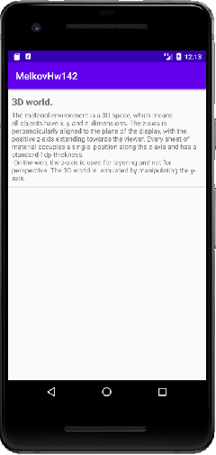

## Задача № 2
### Восстановление данных активити
Пора применить умения, полученные в прошлом домашнем задании, в существующем приложении.

### Задание:
В этом задании нужно взять приложение из задания 4.1.2 и добавить механизм восстановления при повороте экрана.
- Возьмите приложение из задания 4.1.2. Удалите какой-нибудь элемент и поверните экран. Вы увидите, что удаленный элемент появился в списке. Мы добавим механизм восстановления состояния активити, чтобы этого не происходило.
- В Bundle нужно стараться сохранять как можно меньше информации, поэтому мы не будем сохранять весь список List<Map<String, String>>, а сохраним только последовательность индексов удаления. То есть каждый раз, когда мы будем удалять какой-то элемент, мы будем сохранять его индекс. Таким образом, при пересоздании активити мы сможем восстановить ее состояние.

